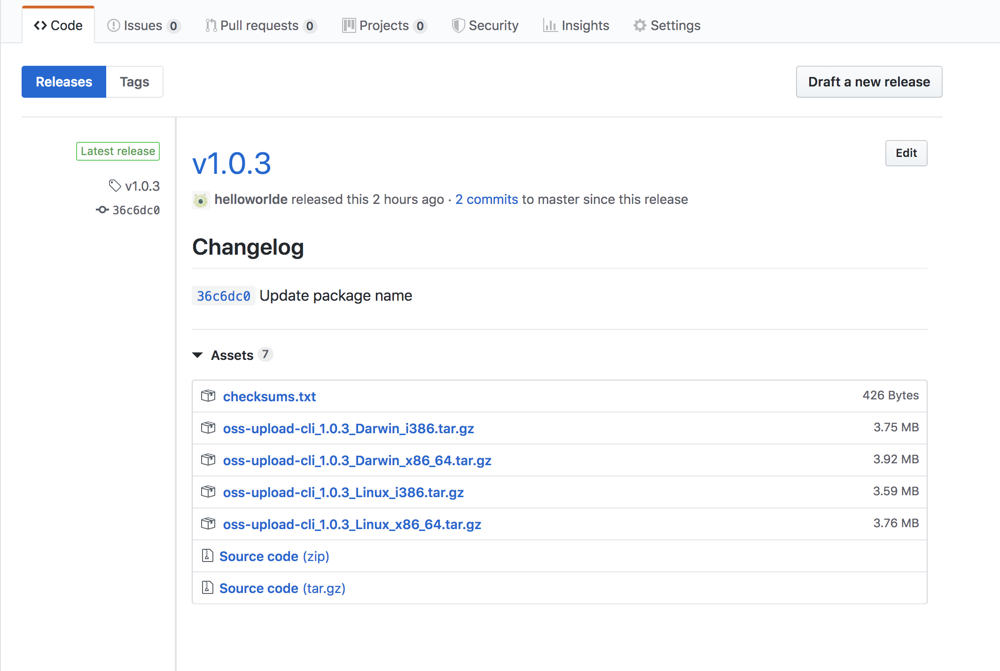

# 使用 Go 开发命令行工具

> 使用 Go 语言开发一个命令行工具，用于向 OSS 文件上传文件
> 命令行工具有很多框架，选择使用 [Cobra](https://github.com/spf13/cobra)

## 准备 

- 安装 Cobra

```bash
go get -u github.com/spf13/cobra/cobra
```


## 初始化项目

- 创建项目

```bash
cd $GOPATH/src
mkdir oss
cd oss
cobra init --pkg-name oss
```

此时，已经创建了一个 oss 的目录，里面已经包含一个 root 命令

```
.
├── LICENSE
├── cmd
│   └── root.go
└── main.go

1 directory, 3 files
```

运行 `go run main.go`查看root 命令

```
go run main.go
A longer description that spans multiple lines and likely contains
examples and usage of using your application. For example:

Cobra is a CLI library for Go that empowers applications.
This application is a tool to generate the needed files
to quickly create a Cobra application.
```

- 添加 mod

添加mod 是为了更方便的管理依赖，module 设置 GitHub 是为了安装方便

```bash
export GO111MODULE=on
go mod init github.com/helloworlde/oss
```

同时需要改下 `mian.go`中的包名，由`oss/cmd`改为 `github.com/helloworlde/oss/cmd`，如果是在GoLand 这样的 IDE 中，还需要启用`Enable Go Modules (vgo) integration`

## 添加命令 

- 添加一个 Upload 命令

```bash
cobra add upload
```
此时，会在 `cmd/`下新建一个`upload.go`的文件，包含基本的运行 upload 命令的代码

```bash
go run main.go upload

upload called
```

在`upload.go`中添加相应的逻辑，具体可以参考 [getting-started](https://github.com/spf13/cobra#getting-started)

```go
var uploadCmd = &cobra.Command{
	Use:   "upload [file]",
	Short: "Upload file to OSS",
	Long:  ``,
	Args: func(cmd *cobra.Command, args []string) error {
		if len(args) < 1 {
			return errors.New("requires at least one file path")
		}
		return nil
	},
	Run: func(cmd *cobra.Command, args []string) {
		dir := cmd.Flag("directory").Value.String()
		picture := cmd.Flag("picture").Value.String()
		markdown := cmd.Flag("markdown").Value.String()

		if !util.ValidateConfig(ossConfig) {
			os.Exit(1)
		}

		bucket := util.InitBucket(ossConfig)
		util.UploadFile(ossDir, path, ossConfig, *bucket)
	},
}

func init() {
	rootCmd.AddCommand(uploadCmd)

	uploadCmd.Flags().StringP("directory", "d", "", "Dictionary of upload file")
	uploadCmd.Flags().BoolP("picture", "p", true, "Upload to Picture folder")
	uploadCmd.Flags().BoolP("markdown", "m", false, "Print link as Markdown")
}
```


## 发布 

先将代码上传到 GitHub，然后可以通过 [goreleaser](https://goreleaser.com/) 这个工具来发布；需要注意的是，Repo 的名字要和 Module 一致，否则会在安装时提示 Module 不匹配

### 安装配置 goreleaser

- 安装 

```bash
brew install goreleaser
```

- 配置

goreleaser 发布时需要使用 GitHub 的 Token，然后需要将 GitHub Token 添加到环境变量中

```bash
export GITHUB_TOKEN=`YOUR_GITHUB_TOKEN`
```

### 发布

- 项目中添加 goreleaser 配置

```bash
goreleaser init
```

- 添加Tag

```bash
git tag -a v0.0.1 -m "First release"
git push origin v0.1.0
```

- 发布 

```bash
goreleaser --rm-dist
```

待上传完成后就可以在 GitHub Release 页面看到刚才发布的版本



## 使用 

### 安装

```bash
go get -u github.com/helloworlde/oss
```

### 使用

- 上传文件 

```bash
oss upload oss-tool.png
```

- 上传到指定文件夹 

```bash
oss upload oss-tool.png -d images/png
```

- 上传文件夹

```bash
oss upload ./cmd -d cmd
```

- 上传图片到指定文件夹

```bash
oss upload oss-tool.png -p
```

- 上传图片后输出 Markdown 格式

```bash
oss upload oss-tool.png -p -m
```